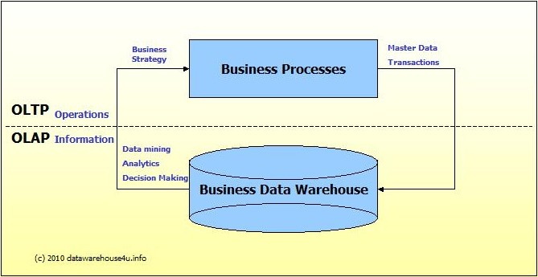
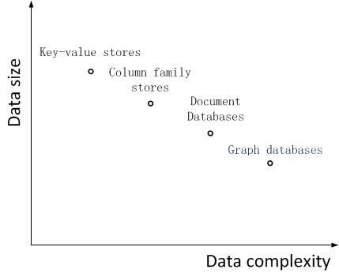
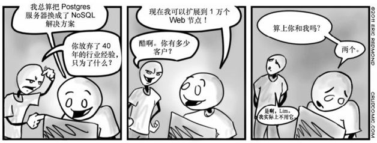
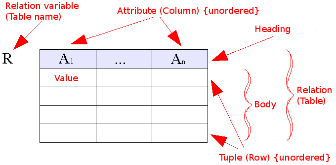
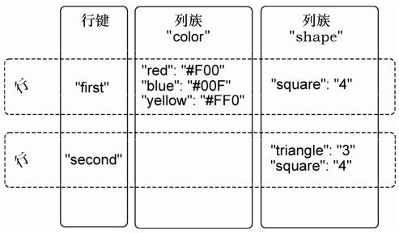
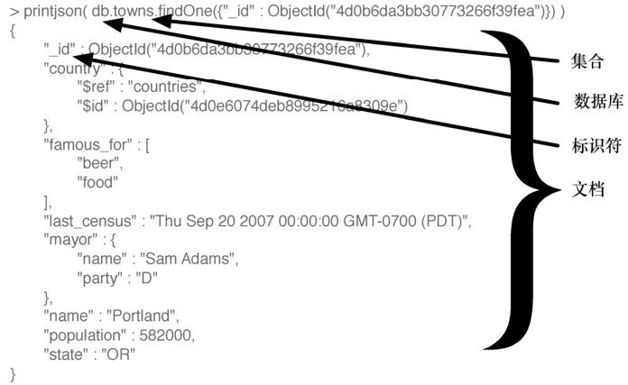
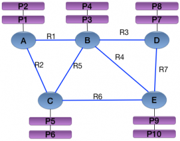
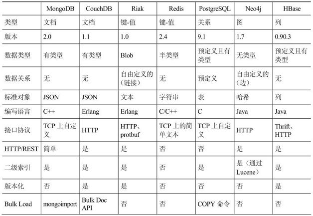
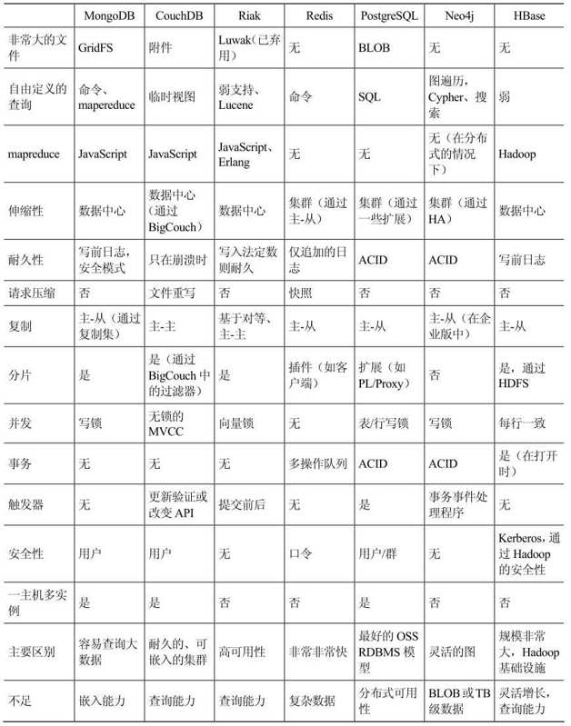

# 数据库选择和实现的微妙平衡 - 《七周七数据库》读书笔记

# 序

这篇分享不讲具体特性，不讲分布式实现，从使用场景和底层存储出发，了解核心概念，重在理解各类型数据库的本质和其设计带来的优缺点，为了帮助大家理解，本文部分知识超出了书本内容，顺序也做了相应调整。

## 关于《七周七数据库》

- 不建议花大量时间去完成新手实践的内容，实际需要时再去了解也不迟，重在扩充知识面。
- 最有价值的是附录和每一章的总结，这两个部分看懂了，整本书就差不多了。
- 翻译一般。

# 从场景出发 - OLTP vs. OLAP

数据处理大致可以分成两大类：

- 联机事务处理OLTP（On-Line Transaction Processing）
- 联机分析处理OLAP（On-Line Analytical Processing）。

OLTP是传统的关系型数据库的主要应用，主要是基本的、日常的事务处理，例如银行交易。
OLAP是数据仓库系统的主要应用，支持复杂的分析操作，侧重决策支持，并且提供直观易懂的查询结果。

OLTP 系统强调数据库内存效率，强调内存各种指标的命令率，强调绑定变量，强调并发操作；
OLAP 系统则强调数据分析，强调SQL执行市场，强调磁盘I/O，强调分区等。

# 从存储出发 - 数据规模与数据复杂度之间的关系

上图是下面介绍的几种 NoSQL 数据库数据规模与数据复杂度之间的关系，我们可以看到，一种数据库实现时，要想承载更大的数据规模，其数据复杂度必须要随之下降，因为关系简单的数据更易进行分片和复制。

接下来简单介绍传统关系型数据库，然后按照横轴方向介绍几种类型的数据库。

# 几种常见数据库类型

## 关系型(Relational DBMS)

关系数据库，是创建在关系模型基础上的数据库，借助于集合代数等数学概念和方法来处理数据库中的数据。

表（关系Relation）是以行（属性Attribute）和列（值组Tuple）的形式组织起来的数据的集合。一个数据库包括一个或多个表（关系Relation）。例如，可能有一个有关作者信息的名为authors的表（关系Relation）。每列（值组Tuple）都包含特定类型的信息，如作者的姓氏。每行（属性Attribute）都包含有关特定作者的所有信息：姓、名、住址等等。在关系型数据库当中一个表（关系Relation）就是一个关系，一个关系数据库可以包含多个表（关系Relation）

关系型数据库的优势在于严格的约束，强一致性和支持灵活的查询，缺点是对水平扩容支持比较差，目前主要高可用方案是通过主从复制实现，数据的水平扩展可以通过分区，分库，分表等策略实现，但是无论是哪种方式，都会有以下问题。

- 事务问题

在执行分库分表之后，由于数据存储到了不同的库上，数据库事务管理出现了困难。如果依赖数据库本身的分布式事务管理功能去执行事务，将付出高昂的性能代价；如果由应用程序去协助控制，形成程序逻辑上的事务，又会造成编程方面的负担。

- 跨库跨表的join问题

在执行了分库分表之后，难以避免会将原本逻辑关联性很强的数据划分到不同的表、不同的库上，这时，表的关联操作将受到限制，我们无法join位于不同分库的表，也无法join分表粒度不同的表，结果原本一次查询能够完成的业务，可能需要多次查询才能完成。

- 额外的数据管理负担和数据运算压力

额外的数据管理负担，最显而易见的就是数据的定位问题和数据的增删改查的重复执行问题，这些都可以通过应用程序解决，但必然引起额外的逻辑运算，例如，对于一个记录用户成绩的用户数据表userTable，业务要求查出成绩最好的100位，在进行分表之前，只需一个order by语句就可以搞定，但是在进行分表之后，将需要n个order by语句，分别查出每一个分表的前100名用户数据，然后再对这些数据进行合并计算，才能得出结果。

## 键-值型(Key-value Stores)

顾名思义，KV存储库将键与值配对，类似于所有流行编程语言中的映射（或哈希表）。某些KV实现允许复杂的值类型，如哈希或列表，但这不是必需的。

键-值型存储可能是数据库管理中最简单的形式，一般来说单纯的键值数据库是不能满足复杂应用的需求的，但是另一方面，其简单的特性让它在特定场景下的表现非常出色。

Riak 是一个分布式的键值数据库，支持 MapReduce 和水平扩容，Riak 允许通过改变三个值：N、W与R，来控制集群的读写。N是一次写入最终复制到的节点数量，换句话说，就是集群中的副本数量。W是一次成功地写入响应之前，必须成功写入的节点数量。如果W小于N，就认为某次写入是成功的，即使Riak依然在复制数据。最后，R是成功读出一项数据所必需的节点数量。如果R比可用的复制数量大，读出请求将会失败。其原理是一致哈希算法，具体逻辑可以阅读[编程之法：算法和面试心得 - 一致性哈希算法](https://wizardforcel.gitbooks.io/the-art-of-programming-by-july/content/a.3.html)。

而 Redis，从基本层面上说，它是一个键-值对存储库。但这种简单的说法并不全面。虽然 Redis 没有达到文档型数据库的程度，但它支持高级的数据结构。它支持基于集合的查询操作，但不支持关系数据库中同样的粒度或类型。当然，它很快，为了速度而在持久性方面作出了让步。

Redis 把自己定义为高级数据结构服务器，此外，它也是阻塞队列（或栈）和发布-订阅系统。它支持可配置的到期策略、持久性级别，以及复制选项。所有这些使得 Redis 不仅是某类数据库中的一员，更是有用的数据结构算法和程序的工具包。

## 宽列型(Wide Column Stores)

列型（或面向列的数据库）的命名源自于其设计的一个重要方面，即来自一个给定的列（在二维表的意义上）的数据存放在一起。相比之下，面向行的数据库（如RDBMS），将一行的信息保存在一起。这种差异看起来似乎无关紧要，但实际上这种设计决策的影响很深。在面向列的数据库中，添加列是相当简易的，而且是逐行完成的。每一行可以有一组不同的列，或完全没有，允许表保持稀疏（sparse），而不会产生空值的存储成本。在结构方面，列型数据库大约介于关系数据库和键-值存储库之间。

你可以把宽列型数据库可以看做是二维的键-值型数据库，就能理解其特性了。

在宽列型数据库中，竞争相比关系数据库或键-值存储较少。我们以 HBase 为例介绍下宽列型数据库的核心概念。

在HBase表中，键可以是任意字符串，每个键都映射到一行数据。行本身也是一个映射表，其中的键称为列，而值就是未解释的字节数组。列按照列族（column family）进行分组，所以列的完全名称包含两个部分：列族名称和列限定符（column qualifier）。通常它们用一个冒号连接起来（例如，'family:qualifier'）。

在这张图中，有一张假想的表，它有两个列族：color和shape。该表有两行（虚线框表示），由行键来唯一标识：first和second。请看第一行，我们看到它在列族color中有3列（限定符分别是red、blue和yellow），在列族shape中有1列（square）。行键和列名（包括列族和限定符）的组合，形成了定位数据的地址。在这个例子中，三元组first/color:red指向了值'#F00'。

## 文档型(Document stores)

我们可以将文档型数据库理解为，值类型为文档的键值数据库，因为其核心的存储引擎实际上就是键值存储，每个文档的键是文档的位置信息，值为存储的文档。位置信息的核心就是每个文档的独一无二的标识符（但并不代表标识符就是文档的位置信息）。

也正因为值为文档，文档型数据库在数据结构上表现出了高度的灵活性，允许有可变域。该系统对输入的数据很少有限制，只要它满足基本要求，可以表示为一个文档。在建索引、自由定义的查询、复制、一致性及其他设计决策等方面，不同的文档数据库采取了不同的方法。

## MongoDB

MongoDB 是目前最为流行的 NoSQL 数据库，它是一种面向集合，模式无关的文档型数据库。其中数据以“集合(Collection)”的方式进行分组，每个集合都有单独的名称并可以包含无限数量的文档。这里的集合同关系型数据库中的表（table）类似，唯一的区别就是它并没有任何明确的结构，文档（Document）是集合中数据的最小单元，概念可以与关系型数据库中的行（row）对应。

虽然我们与 MongoDB 交互式时的数据是 JSON 格式的，但实际上 MongoDB 数据库中的数据存储和网络传输格式是 BSON，它是一种二进制表示形式，能用来表示简单数据结构、关联数组（MongoDB中称为“对象”或“文档”）以及MongoDB中的各种数据类型。BSON之名缘于JSON，含义为Binary JSON（二进制JSON）。

与JSON相比，BSON 着眼于提高存储和扫描效率。BSON 文档中的大型元素以长度字段为前缀以便于扫描。在某些情况下，由于长度前缀和显式数组索引的存在，BSON使用的空间会多于JSON。

## 图型(Graph DBMS)

这是一种不太常用的数据库类型，图数据库善于处理高度互联的数据。图数据库包含节点及节点之间的关系。节点和关系可以有一些属性（一些键-值对），用来存储数据。图数据库的真正实力是按照关系遍历节点。

图型数据库通常不能提供所有节点的索引，根据属性值直接访问节点是无法实现的，必须要通过遍历。

图型数据库的代表是 Neo4j，Neo4j 被称为 property graph，除了顶点（Node）和边(Relationship，其包含一个类型)，还有一种重要的部分——属性。无论是顶点还是边，都可以有任意多的属性。属性的存放类似于一个哈希表，键为一个字符串，而值必须是 Java基本类型、或者是基本类型数组，比如说String、int或者int[]都是合法的。

在这个例子中，A~E表示 Node 的编号，R1~R7 表示 Relationship 编号，P1~P10 表示Property 的编号。

Node 的存储示例图如下,每个 Node 保存了第1个 Property 和 第1个 Relationship：

Relationship 的存储示意图如下：

从示意图可以看出，从 Node-B 开始，可以通过关系的 next 指针，遍历Node-B 的所有关系，然后可以到达与其有关系的第1层Nodes,在通过遍历第1层Nodes的关系，可以达到第2层Nodes,…

# 从 CAP 定理出发

CAP理论主张任何基于网络的数据共享系统，都最多只能拥有以下三条中的两条：

- 数据一致性（C），等同于所有节点访问同一份最新的数据副本；
- 对数据更新具备高可用性（A）；
- 能容忍网络分区（P）。

# 附录：数据库对比表格

> 来自《七周七数据库》，相关数据可能随时间发生变化

# 附录：推荐阅读

- [CAP理论十二年回顾："规则"变了](http://www.infoq.com/cn/articles/cap-twelve-years-later-how-the-rules-have-changed)
- [分布式数据库TiDB整体概述](http://www.ywnds.com/?p=12418)

# 参考链接

- [《七周七数据库》](http://www.ireadweek.com/index.php/bookInfo/3556.html)
- [https://db-engines.com/en/system/InfluxDB](https://db-engines.com/en/system/InfluxDB)
- [https://db-engines.com/en/article/Time+Series+DBMS](https://db-engines.com/en/article/Time+Series+DBMS)
- [http://qinxuye.me/article/introduction-to-neo4j/](http://qinxuye.me/article/introduction-to-neo4j/)
- [https://db-engines.com/en/article/Graph+DBMS](https://db-engines.com/en/article/Graph+DBMS)
- [OLTP和OLAP浅析](http://blog.51cto.com/76287/885475)
- [https://db-engines.com/en/article/Wide+Column+Stores](https://db-engines.com/en/article/Wide+Column+Stores)
- [https://db-engines.com/en/article/Relational+DBMS](https://db-engines.com/en/article/Relational+DBMS)
- [Neo4j 底层存储结构分析](http://sunxiang0918.cn/2015/06/27/neo4j-%E5%BA%95%E5%B1%82%E5%AD%98%E5%82%A8%E7%BB%93%E6%9E%84%E5%88%86%E6%9E%90/)
- [Sharding：分表、分库、分片和分区](https://blog.csdn.net/KingCat666/article/details/78324678)
- [Key-value Stores](https://db-engines.com/en/article/Key-value+Stores)
- [HBase](https://db-engines.com/en/system/HBase)
- [Cassandra](https://db-engines.com/en/system/Cassandra)
- [BSON](http://bsonspec.org/)
- [MongoDB · 引擎特性 · MongoDB索引原理](http://mysql.taobao.org/monthly/2018/09/06/)
- [OLTP-vs-OLAP](http://datawarehouse4u.info/OLTP-vs-OLAP.html)
- [聊聊MySQL、HBase、ES的特点和区别](https://www.jianshu.com/p/4e412f48e820)
- [MySQL · 引擎特性 · InnoDB 文件系统之文件物理结构](http://mysql.taobao.org/monthly/2016/02/01/)

